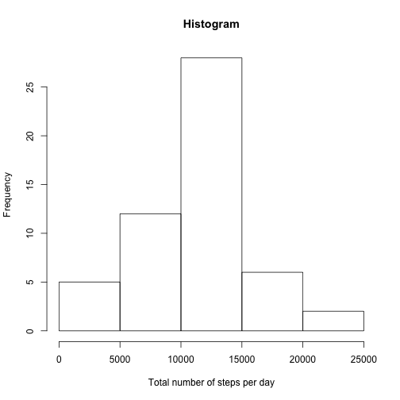
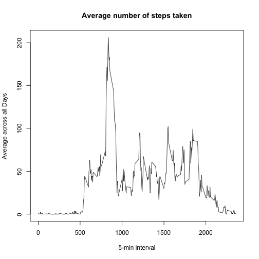
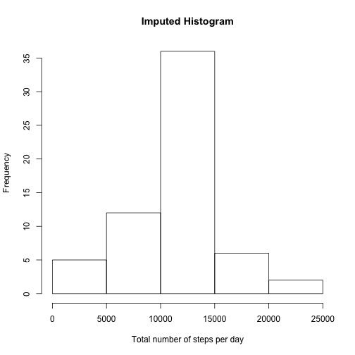
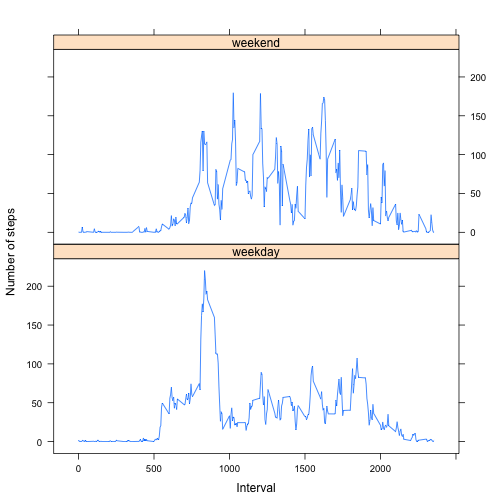

## Loading and preprocessing the data

```r
setwd("~/DataScience/RepData_PeerAssessment1")
unzip("activity.zip")
activity <- read.csv("activity.csv")
```


## What is mean total number of steps taken per day?

```r
# 1. Calculate the total number of steps taken per day
stepsDay <- aggregate(steps ~ date, data = activity, FUN = sum, na.rm = TRUE)
# 2. Make a histogram of the total number of steps taken each day
hist(stepsDay$steps,
     xlab = "Total number of steps per day", 
     ylab = "Frequency", 
     main = "Histogram")
```

 

```r
# 3. Calculate and report the mean and median of the total number of steps taken per day
mean(stepsDay$steps)
```

```
## [1] 10766.19
```

```r
median(stepsDay$steps)
```

```
## [1] 10765
```


## What is the average daily activity pattern?

```r
# 1. Make a time series plot (i.e. type = "l") of the 5-minute interval (x-axis) and the average number of steps taken, averaged across all days (y-axis)
stepsInterval <- aggregate(steps ~ interval, data = activity, FUN = mean, na.rm = TRUE)
plot(stepsInterval, 
     type = "l", 
     xlab = "5-min interval", 
     ylab = "Average across all Days", 
     main = "Average number of steps taken")
```

 

```r
# 2. Which 5-minute interval, on average across all the days in the dataset, contains the maximum number of steps?
maxSteps <- which.max(stepsInterval$steps)
stepsInterval[maxSteps,]
```

```
##     interval    steps
## 104      835 206.1698
```


## Imputing missing values

```r
# 1. Calculate and report the total number of missing values in the dataset (i.e. the total number of rows with NAs)
sum(is.na(activity))
```

```
## [1] 2304
```

```r
# 2. Devise a strategy for filling in all of the missing values in the dataset. 
imputedActivity <- merge(activity, stepsInterval, by = "interval", , suffixes = c("", "Mean"))
naSteps <- is.na(imputedActivity$steps)

# 3. Create a new dataset that is equal to the original dataset but with the missing data filled in.
imputedActivity$steps[naSteps] <- imputedActivity$stepsMean[naSteps]

# 4. Make a histogram of the total number of steps taken each day and Calculate and report the mean and median total number of steps taken per day.
imputedStepsDay <- aggregate(steps ~ date, data = imputedActivity, FUN = sum, na.rm = TRUE)

hist(imputedStepsDay$steps,
     xlab = "Total number of steps per day", 
     ylab = "Frequency", 
     main = "Imputed Histogram")
```

 

```r
mean(imputedStepsDay$steps)
```

```
## [1] 10766.19
```

```r
median(imputedStepsDay$steps)
```

```
## [1] 10766.19
```

Q: Do these values differ from the estimates from the first part of the assignment?    
A: Yes

Q: What is the impact of imputing missing data on the estimates of the total daily number of steps?   
A: The mean has increased.

## Are there differences in activity patterns between weekdays and weekends?

```r
# 1. Create a new factor variable in the dataset with two levels – “weekday” and “weekend” indicating whether a given date is a weekday or weekend day.
imputedActivity$daytype <- ifelse(weekdays(as.Date(imputedActivity$date)) %in% c("Satuday", "Sunday"), "weekend", "weekday")

# 2. Make a panel plot containing a time series plot (i.e. type = "l") of the 5-minute interval (x-axis) and the average number of steps taken, averaged across all weekday days or weekend days (y-axis).
imputedStepsInterval <- aggregate(steps ~ interval + daytype, data = imputedActivity, FUN = mean, na.rm = TRUE)

library(lattice)
xyplot(steps ~ interval | daytype, imputedStepsInterval, 
       type = "l", 
       layout = c(1, 2), 
       xlab = "Interval", 
       ylab = "Number of steps")
```

 


Q: Are there differences in activity patterns between weekdays and weekends?   
A: Yes, there are differences. People seem to be more active thoughout the day, while there is a distinct peak in the beginning of weekdays.

